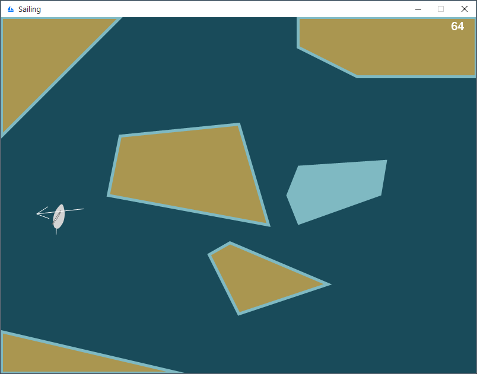
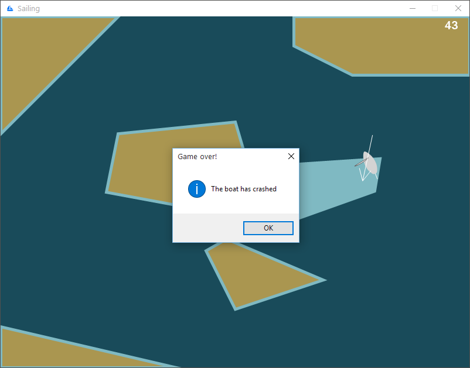

# Sailing

Simple 2D sailing simulator written on C#.

## Screenshots

## Control keys

| Keys            | Action                  |
| --------------- | ----------------------- |
| Space           | stop/resume simulation  |
| Q, W            | set sail angle          |
| Right, Left, Up | set rudder angle        |
| Backspace       | reverse wind direction  |
| +, –            | change simulation speed |
| R               | reset simulation        |

## Requirements

Project create in Visual Studio 2013 and using .NET Framework 4.5.1